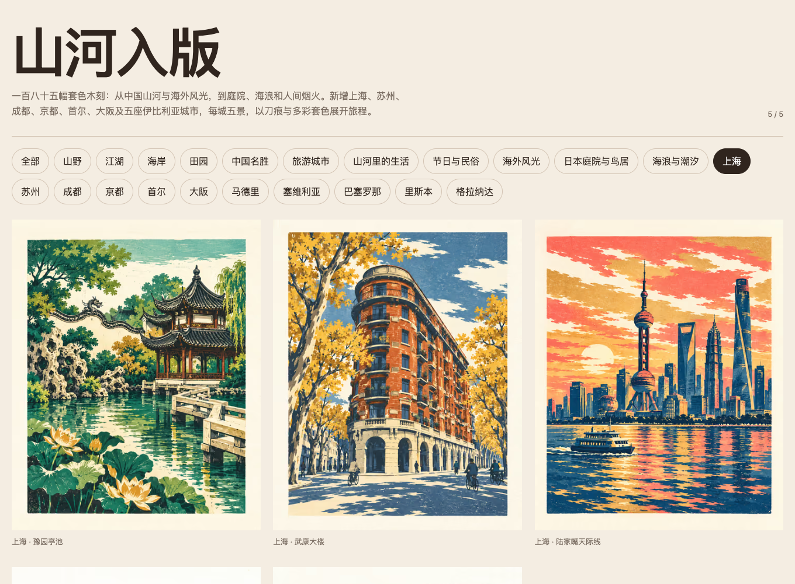

# 山河入版 / Shanhe Gallery

185张套色木刻风格原创AI画作，涵盖山河、名胜、生活、节庆、海外风光及十一城五景。支持分类浏览、全屏灯箱、键盘切换和下载。由内置image_gen生成；原图在incoming/，准确提示词在prompts.json。

An accessible gallery of 185 original AI-generated multicolor woodcut-style artworks, featuring landscapes, landmarks, everyday life, festivals and five scenes from each of eleven cities. Includes category filters, keyboard navigation, a full-screen lightbox and image downloads. Original images and generation prompts are preserved in this repository.



## 在线体验 / Live Demo

- [Cloudflare Demo](https://shanhe-gallery.xiaosang.cc/)
- [GitHub Repo](https://github.com/holynova/shanhe-gallery)


## 本地运行 / Run locally

```sh
npm ci
npm run build
npm run preview -- --host 127.0.0.1 --port 4327
```

## 发布 / Deploy

```sh
npm run check
npm test
npm run deploy:check
npm run deploy
```

Cloudflare Workers Static Assets · shanhe-gallery.xiaosang.cc · v0.1.2

源码与部署配置均在main维护；本地手动部署。详细生成与验证记录见GALLERY.md。
Source and deployment configuration share the main branch. Deploy manually from the same commit. See GALLERY.md for generation and validation records.
